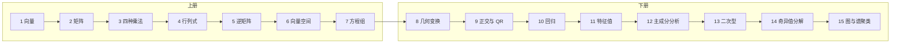

# 《线性代数不难》项目综述

本仓库是鸢尾花书「数学不难」系列《线性代数不难》（Linear Algebra Made Easy）的配套材料：中英文讲义、课件，以及用 Python 把公式算出来、画出来的 Jupyter 笔记本。各章材料按章放在文件夹里，从 `00_正文前` 到 `15_图与网络`，文件名仍是 `LA_章_节_...`。

上下册的分工在正文前写得很清楚。上册备齐向量、矩阵、矩阵乘法、行列式、逆矩阵、向量空间和线性方程组。下册把这些工具用在几何变换、正交与 QR、回归、特征值分解、主成分分析、二次型、奇异值分解，以及图和谱聚类上。

建议的读法是：先看该节中文讲义建立几何图像，课件用来快速翻图，有笔记本就在 Jupyter 里把计算跑一遍。英文讲义和课件用来对照术语。系列在鸢尾花书中的位置见 [整体布局](00_正文前/鸢尾花书_整体布局.pdf)。

## 目录

| 册 | 章 | 主题 | 这一章在解决什么 |
| --- | --- | --- | --- |
| 开篇 | [开篇](#ch00) | 正文前 | 怎么读这本书，上下册各讲什么 |
| 上册 | [第 1 章](#ch01) | 向量 | 从数组和颜色出发认识向量，再放进坐标系，依次做加减、数乘、单位化、内积、投影和范数。 |
| 上册 | [第 2 章](#ch02) | 矩阵 | 行向量和列向量都是矩阵。 |
| 上册 | [第 3 章](#ch03) | 矩阵乘法的四种视角 | 同一件事用四种看法重讲：内积、外积、列向量线性组合、行向量线性组合，最后用分块乘法收束。 |
| 上册 | [第 4 章](#ch04) | 行列式 | 行列式在这里是工具，先看几何：2×2 对应平行四边形面积，3×3 对应平行六面体体积，然后再讲性质和 Laplace 展开。 |
| 上册 | [第 5 章](#ch05) | 逆矩阵 | 可逆就是几何变换存在逆操作。 |
| 上册 | [第 6 章](#ch06) | 向量空间 | 有了向量、乘法和逆矩阵之后，秩、线性组合和基底就比较好懂。 |
| 上册 | [第 7 章](#ch07) | 线性方程组 | 方程组放在工具齐备之后，当成矩阵乘法的一次应用。 |
| 下册 | [第 8 章](#ch08) | 几何变换 | 下册的起点，也是上册工具的总复习。 |
| 下册 | [第 9 章](#ch09) | 正交矩阵与 QR 分解 | 正文把这一章称作投影的延续：先看 2×2、3×3 正交矩阵及其性质，再做格拉姆-施密特正交化，并把它写成完全型与经济型 QR 分解。 |
| 下册 | [第 10 章](#ch10) | 回归 | 把正交投影用到拟合上：一元、过原点、二元和多项式回归。 |
| 下册 | [第 11 章](#ch11) | 特征值分解 | 特征向量是矩阵固有的方向，特征值是这些方向上的伸缩。 |
| 下册 | [第 12 章](#ch12) | 主成分分析 | 从数据矩阵、中心化、协方差和相关系数出发，用特征值分解找出数据里最重要的方向。 |
| 下册 | [第 13 章](#ch13) | 二次型 | 正定、半正定和负定的几何含义，正定矩阵上的 Cholesky 分解，瑞利商，以及和旋转椭圆连在一起的距离（尤其是马氏距离）。 |
| 下册 | [第 14 章](#ch14) | 奇异值分解 | 用格拉姆矩阵的谱分解还原 SVD，再比较四种形式和截断分解。 |
| 下册 | [第 15 章](#ch15) | 图与网络 | 把图写成矩阵：无向图和有向图的邻接矩阵、度矩阵、转移矩阵，最后用归一化拉普拉斯矩阵做谱聚类。 |

## 材料形态

| 形态 | 文件名里常见的标记 | 作用 |
| --- | --- | --- |
| 中文讲义 | 节号后直接是中文标题，例如 `LA_01_01_什么是向量.pdf` | 一节的正文草稿 |
| 英文讲义 | 文件名以 `_EN.pdf` 结尾 | 同一节的英文稿 |
| 中文课件 | 文件名含 `PPT` 和 `中文` | 用来翻图、看几何关系 |
| 英文课件 | 文件名含 `PPT` 和 `_EN` | 英文图示 |
| 笔记本 | `LA_章_节_序号.ipynb` | 可运行的计算与可视化 |
| 数据 | `X_df_iris.pkl`、`X_df.pkl` | 第 12 章主成分分析用的表 |

多数节是「中文讲义 + 英文讲义 + 中文课件 + 英文课件」。计算密的节再配一本或多本笔记本。第 12、13 章没有课件；第 13 章也没有笔记本。

## 一条阅读主线



按章号从 1 读到 15。后面几章会回头用前面的工具：回归用正交投影，主成分分析和谱聚类用特征值分解，奇异值分解用格拉姆矩阵的谱分解。

## 分章索引

每一行是一节。笔记本列里的链接打开后可以直接运行。某一格是「—」，表示仓库里没有对应文件。

<a id="ch00"></a>

### 开篇　正文前

上下册的前言、使用说明和绪论。绪论说明这本书为什么从几何直觉讲线性代数，以及上下册各自覆盖什么。

| 节 | 主题 | 中文讲义 | 英文讲义 | 中文课件 | 英文课件 | 笔记本 |
| --- | --- | --- | --- | --- | --- | --- |
| 0 | 正文前 | [讲义](00_正文前/LA_00_上册_正文前_V2.pdf) | [讲义](00_正文前/LA_00_Front_Matter_Vol1_EN.pdf) | [课件](00_正文前/LA_00_PPT_线性代数不难_正文前_中文.pdf) | [课件](00_正文前/LA_00_PPT_Linear%20Algebra%20Made%20Easy%20and%20Visual%20with%20Python_Front_Matter_EN.pdf) | — |

中文讲义链到上册正文前；下册正文前见 [LA_00_下册_正文前_V2.pdf](00_正文前/LA_00_下册_正文前_V2.pdf)。英文正文前目前只有上册。


[回到目录](#目录)

<a id="ch01"></a>

### 第 1 章　向量

从数组和颜色出发认识向量，再放进坐标系，依次做加减、数乘、单位化、内积、投影和范数。几何图形贯穿整章。

| 节 | 主题 | 中文讲义 | 英文讲义 | 中文课件 | 英文课件 | 笔记本 |
| --- | --- | --- | --- | --- | --- | --- |
| 1.1 | 什么是向量 | [讲义](01_向量/LA_01_01_什么是向量.pdf) | [讲义](01_向量/LA_01_01_What_Is_a_Vector_EN.pdf) | [课件](01_向量/LA_01_01_PPT_什么是向量_中文.pdf) | [课件](01_向量/LA_01_01_PPT_What_Is_A_Vector_EN.pdf) | [一维数组](01_向量/LA_01_01_01.ipynb)<br>[二维数组创建向量](01_向量/LA_01_01_02.ipynb) |
| 1.2 | 坐标系 | [讲义](01_向量/LA_01_02_坐标系.pdf) | [讲义](01_向量/LA_01_02_Coordinate_Systems_EN.pdf) | [课件](01_向量/LA_01_02_PPT_坐标系_中文.pdf) | [课件](01_向量/LA_01_02_PPT_Coordinate_Systems_EN.pdf) | [二维网格](01_向量/LA_01_02_01.ipynb)<br>[三维网格](01_向量/LA_01_02_02.ipynb)<br>[向量大小](01_向量/LA_01_02_03.ipynb) |
| 1.3 | 向量加减法 | [讲义](01_向量/LA_01_03_向量加减法.pdf) | [讲义](01_向量/LA_01_03_Vector_Addition_and_Subtraction_EN.pdf) | [课件](01_向量/LA_01_03_PPT_向量加减法_中文.pdf) | [课件](01_向量/LA_01_03_PPT_Vector_Addition_and_Subtraction_EN.pdf) | [向量加法](01_向量/LA_01_03_01.ipynb)<br>[平行四边形法则](01_向量/LA_01_03_02.ipynb)<br>[三角形法则](01_向量/LA_01_03_03.ipynb) |
| 1.4 | 标量乘法 | [讲义](01_向量/LA_01_04_向量标量乘法.pdf) | [讲义](01_向量/LA_01_04_Vector_Scalar_Multiplication_EN.pdf) | [课件](01_向量/LA_01_04_PPT_向量标量乘法_中文.pdf) | [课件](01_向量/LA_01_04_PPT_Vector_Scalar_Multiplication_EN.pdf) | [标量乘法](01_向量/LA_01_04_01.ipynb)<br>[可视化标量乘法](01_向量/LA_01_04_02.ipynb) |
| 1.5 | 单位向量 | [讲义](01_向量/LA_01_05_单位向量.pdf) | [讲义](01_向量/LA_01_05_Unit_Vector_EN.pdf) | [课件](01_向量/LA_01_05_PPT_单位向量_中文.pdf) | [课件](01_向量/LA_01_05_PPT_Unit_Vector_EN.pdf) | [单位向量](01_向量/LA_01_05_01.ipynb)<br>[极坐标与直角坐标](01_向量/LA_01_05_02.ipynb)<br>[直角坐标系画单位圆](01_向量/LA_01_05_03.ipynb)<br>[极坐标画同心圆](01_向量/LA_01_05_04.ipynb)<br>[球坐标与三维直角坐标](01_向量/LA_01_05_05.ipynb)<br>[可视化正球体](01_向量/LA_01_05_06.ipynb) |
| 1.6 | 内积 | [讲义](01_向量/LA_01_06_向量内积.pdf) | [讲义](01_向量/LA_01_06_Vector_Inner_Product_EN.pdf) | [课件](01_向量/LA_01_06_PPT_向量内积_中文.pdf) | [课件](01_向量/LA_01_06_PPT_Vector_Inner_Product_EN.pdf) | [向量内积](01_向量/LA_01_06_01.ipynb)<br>[向量夹角](01_向量/LA_01_06_02.ipynb) |
| 1.7 | 投影 | [讲义](01_向量/LA_01_07_投影.pdf) | [讲义](01_向量/LA_01_07_Projection_EN.pdf) | [课件](01_向量/LA_01_07_PPT_投影_中文.pdf) | [课件](01_向量/LA_01_07_PPT_Projection_EN.pdf) | [标量投影](01_向量/LA_01_07_01.ipynb)<br>[向量投影](01_向量/LA_01_07_02.ipynb)<br>[向量正交分解](01_向量/LA_01_07_03.ipynb) |
| 1.8 | 范数 | [讲义](01_向量/LA_01_08_向量范数.pdf) | [讲义](01_向量/LA_01_08_Vector_Norm_EN.pdf) | [课件](01_向量/LA_01_08_PPT_向量范数_中文.pdf) | [课件](01_向量/LA_01_08_PPT_Vector_Norm_EN.pdf) | [L1 范数](01_向量/LA_01_08_01.ipynb)<br>[L1 等距线](01_向量/LA_01_08_02.ipynb)<br>[L2 范数](01_向量/LA_01_08_03.ipynb)<br>[L2 等距线](01_向量/LA_01_08_04.ipynb)<br>[L∞ 范数](01_向量/LA_01_08_05.ipynb) |

[回到目录](#目录)

<a id="ch02"></a>

### 第 2 章　矩阵

行向量和列向量都是矩阵。这一章先熟悉形状、索引和转置，再用规则、几何变换和运算性质把矩阵乘法走一遍。

| 节 | 主题 | 中文讲义 | 英文讲义 | 中文课件 | 英文课件 | 笔记本 |
| --- | --- | --- | --- | --- | --- | --- |
| 2.1 | 矩阵 | [讲义](02_矩阵/LA_02_01_矩阵.pdf) | [讲义](02_矩阵/LA_02_01_Matrix_EN.pdf) | [课件](02_矩阵/LA_02_01_PPT_矩阵_中文.pdf) | [课件](02_矩阵/LA_02_01_PPT_Matrix_EN.pdf) | [索引与切片](02_矩阵/LA_02_01_01.ipynb)<br>[加减与数乘](02_矩阵/LA_02_01_02.ipynb) |
| 2.2 | 矩阵转置 | [讲义](02_矩阵/LA_02_02_矩阵转置.pdf) | [讲义](02_矩阵/LA_02_02_Matrix_Transpose_EN.pdf) | [课件](02_矩阵/LA_02_02_PPT_矩阵转置_中文.pdf) | [课件](02_矩阵/LA_02_02_PPT_Transpose_EN.pdf) | [矩阵转置](02_矩阵/LA_02_02_01.ipynb)<br>[不同形状的转置](02_矩阵/LA_02_02_02.ipynb) |
| 2.3 | 矩阵的形状 | [讲义](02_矩阵/LA_02_03_矩阵的形状.pdf) | [讲义](02_矩阵/LA_02_03_Matrix_Shape_EN.pdf) | [课件](02_矩阵/LA_02_03_PPT_矩阵的形状_中文.pdf) | [课件](02_矩阵/LA_02_03_PPT_Shape_of_Matrix_EN.pdf) | — |
| 2.4 | 矩阵乘法 | [讲义](02_矩阵/LA_02_04_矩阵乘法.pdf) | [讲义](02_矩阵/LA_02_04_Matrix_Multiplication_EN.pdf) | [课件](02_矩阵/LA_02_04_PPT_矩阵乘法_中文.pdf) | [课件](02_矩阵/LA_02_04_PPT_Matrix_Multiplication_EN.pdf) | [热图看乘法](02_矩阵/LA_02_04_01.ipynb)<br>[逐元素计算](02_矩阵/LA_02_04_02.ipynb)<br>[自定义乘法函数](02_矩阵/LA_02_04_03.ipynb) |
| 2.5 | 矩阵乘法的几何视角 | [讲义](02_矩阵/LA_02_05_矩阵乘法几何视角.pdf) | [讲义](02_矩阵/LA_02_05_Geometric_Perspective_EN.pdf) | [课件](02_矩阵/LA_02_05_PPT_矩阵乘法的几何视角_中文.pdf) | [课件](02_矩阵/LA_02_05_PPT_Geometric_View_of_Matrix_Multiplication_EN.pdf) | — |
| 2.6 | 矩阵乘法的性质 | [讲义](02_矩阵/LA_02_06_矩阵乘法性质.pdf) | [讲义](02_矩阵/LA_02_06_Matrix_Multiplication_Properties_EN.pdf) | [课件](02_矩阵/LA_02_06_PPT_矩阵乘法性质_中文.pdf) | [课件](02_矩阵/LA_02_06_PPT_Properties_of_Matrix_Multiplication_EN.pdf) | — |

[回到目录](#目录)

<a id="ch03"></a>

### 第 3 章　矩阵乘法的四种视角

同一件事用四种看法重讲：内积、外积、列向量线性组合、行向量线性组合，最后用分块乘法收束。外积和列组合会在后面的谱分解、奇异值分解和线性方程组里反复出现。

| 节 | 主题 | 中文讲义 | 英文讲义 | 中文课件 | 英文课件 | 笔记本 |
| --- | --- | --- | --- | --- | --- | --- |
| 3.1 | 第一视角：内积 | [讲义](03_矩阵乘法/LA_03_01_矩阵乘法第一视角.pdf) | [讲义](03_矩阵乘法/LA_03_01_Matrix_Multiplication_First_Perspective_EN.pdf) | [课件](03_矩阵乘法/LA_03_01_PPT_矩阵乘法第一视角_中文.pdf) | [课件](03_矩阵乘法/LA_03_01_PPT_First_View_of_Matrix_Multiplication_EN.pdf) | [内积视角逐步计算](03_矩阵乘法/LA_03_01_01.ipynb)<br>[自定义函数：内积视角](03_矩阵乘法/LA_03_01_02.ipynb) |
| 3.2 | 第二视角：外积 | [讲义](03_矩阵乘法/LA_03_02_矩阵乘法第二视角.pdf) | [讲义](03_矩阵乘法/LA_03_02_Matrix_Multiplication_Second_Perspective_EN.pdf) | [课件](03_矩阵乘法/LA_03_02_PPT_矩阵乘法的第二视角_中文.pdf) | [课件](03_矩阵乘法/LA_03_02_PPT_Second_View_of_Matrix_Multiplication_EN.pdf) | [外积视角逐步计算](03_矩阵乘法/LA_03_02_01.ipynb)<br>[热图看外积视角](03_矩阵乘法/LA_03_02_02.ipynb)<br>[自定义函数：外积视角](03_矩阵乘法/LA_03_02_03.ipynb) |
| 3.3 | 第三视角：列向量线性组合 | [讲义](03_矩阵乘法/LA_03_03_矩阵乘法第三视角.pdf) | [讲义](03_矩阵乘法/LA_03_03_Matrix_Multiplication_Third_Perspective_EN.pdf) | [课件](03_矩阵乘法/LA_03_03_PPT_矩阵乘法的第三视角_中文.pdf) | [课件](03_矩阵乘法/LA_03_03_PPT_Third_View_of_Matrix_Multiplication_EN.pdf) | [列组合逐步计算](03_矩阵乘法/LA_03_03_01.ipynb)<br>[热图看列组合](03_矩阵乘法/LA_03_03_02.ipynb)<br>[自定义函数：列组合](03_矩阵乘法/LA_03_03_03.ipynb) |
| 3.4 | 第四视角：行向量线性组合 | [讲义](03_矩阵乘法/LA_03_04_矩阵乘法第四视角.pdf) | [讲义](03_矩阵乘法/LA_03_04_Matrix_Multiplication_Fourth_Perspective_EN.pdf) | [课件](03_矩阵乘法/LA_03_04_PPT_矩阵乘法的第四视角_中文.pdf) | [课件](03_矩阵乘法/LA_03_04_PPT_Fourth_View_of_Matrix_Multiplication_EN.pdf) | [行组合逐步计算](03_矩阵乘法/LA_03_04_01.ipynb)<br>[热图看行组合](03_矩阵乘法/LA_03_04_02.ipynb)<br>[自定义函数：行组合](03_矩阵乘法/LA_03_04_03.ipynb) |
| 3.5 | 分块矩阵乘法 | [讲义](03_矩阵乘法/LA_03_05_分块矩阵乘法.pdf) | [讲义](03_矩阵乘法/LA_03_05_Block_Matrix_Multiplication_EN.pdf) | [课件](03_矩阵乘法/LA_03_05_PPT_分块矩阵乘法_中文.pdf) | [课件](03_矩阵乘法/LA_03_05_PPT_Block_Matrix_Multiplication_EN.pdf) | — |

[回到目录](#目录)

<a id="ch04"></a>

### 第 4 章　行列式

行列式在这里是工具，先看几何：2×2 对应平行四边形面积，3×3 对应平行六面体体积，然后再讲性质和 Laplace 展开。

| 节 | 主题 | 中文讲义 | 英文讲义 | 中文课件 | 英文课件 | 笔记本 |
| --- | --- | --- | --- | --- | --- | --- |
| 4.1 | 2×2 行列式 | [讲义](04_行列式/LA_04_01_2x2行列式.pdf) | [讲义](04_行列式/LA_04_01_2x2_Determinant_EN.pdf) | [课件](04_行列式/LA_04_01_PPT_2x2矩阵行列式_中文.pdf) | [课件](04_行列式/LA_04_01_PPT_The_2x2_Determinant_EN.pdf) | [平行四边形面积](04_行列式/LA_04_01_01.ipynb) |
| 4.2 | 3×3 行列式 | [讲义](04_行列式/LA_04_02_3x3矩阵行列式.pdf) | [讲义](04_行列式/LA_04_02_3x3_Determinant_EN.pdf) | [课件](04_行列式/LA_04_02_PPT_3x3矩阵行列式_中文.pdf) | [课件](04_行列式/LA_04_02_PPT_The_3x3_Determinant_EN.pdf) | [平行六面体体积](04_行列式/LA_04_02_01.ipynb) |
| 4.3 | 行列式的性质 | [讲义](04_行列式/LA_04_03_行列式的性质.pdf) | [讲义](04_行列式/LA_04_03_Determinant_Properties_EN.pdf) | [课件](04_行列式/LA_04_03_PPT_常见行列式性质_中文.pdf) | [课件](04_行列式/LA_04_03_PPT_Common_Properties_of_Determinants_EN.pdf) | — |
| 4.4 | 手算行列式 | [讲义](04_行列式/LA_04_04_手算行列式.pdf) | [讲义](04_行列式/LA_04_04_Determinant_by_Hand_EN.pdf) | [课件](04_行列式/LA_04_04_PPT_手解行列式_中文.pdf) | [课件](04_行列式/LA_04_04_PPT_Solving_Determinants_by_Hand_EN.pdf) | [Laplace 展开](04_行列式/LA_04_04_01.ipynb) |

笔记本按第一行做 Laplace 展开，递归计算行列式，并提取余子矩阵。


[回到目录](#目录)

<a id="ch05"></a>

### 第 5 章　逆矩阵

可逆就是几何变换存在逆操作。先用缩放、旋转、剪切理解逆矩阵，再看性质，最后用伴随矩阵法手算。

| 节 | 主题 | 中文讲义 | 英文讲义 | 中文课件 | 英文课件 | 笔记本 |
| --- | --- | --- | --- | --- | --- | --- |
| 5.1 | 矩阵的逆 | [讲义](05_逆矩阵/LA_05_01_矩阵的逆.pdf) | [讲义](05_逆矩阵/LA_05_01_Inverse_of_a_Matrix_EN.pdf) | [课件](05_逆矩阵/LA_05_01_PPT_逆矩阵_中文.pdf) | [课件](05_逆矩阵/LA_05_01_PPT_The_Inverse_Matrix_EN.pdf) | [2×2 求逆](05_逆矩阵/LA_05_01_01.ipynb)<br>[NumPy 求逆](05_逆矩阵/LA_05_01_02.ipynb)<br>[SymPy 求逆](05_逆矩阵/LA_05_01_03.ipynb) |
| 5.2 | 逆矩阵的性质 | [讲义](05_逆矩阵/LA_05_02_矩阵逆的性质.pdf) | [讲义](05_逆矩阵/LA_05_02_Properties_of_Matrix_Inverse_EN.pdf) | [课件](05_逆矩阵/LA_05_02_PPT_逆矩阵的性质_中文.pdf) | [课件](05_逆矩阵/LA_05_02_PPT_Properties_of_the_Matrix_Inverse_EN.pdf) | — |
| 5.3 | 手解逆矩阵 | [讲义](05_逆矩阵/LA_05_03_手解矩阵逆.pdf) | [讲义](05_逆矩阵/LA_05_03_Solving_Matrix_Inverse_by_Hand_EN.pdf) | [课件](05_逆矩阵/LA_05_03_PPT_手解逆矩阵_中文.pdf) | [课件](05_逆矩阵/LA_05_03_PPT_Solving_the_Inverse_by_Hand_EN.pdf) | [伴随矩阵法](05_逆矩阵/LA_05_03_01.ipynb) |

[回到目录](#目录)

<a id="ch06"></a>

### 第 6 章　向量空间

有了向量、乘法和逆矩阵之后，秩、线性组合和基底就比较好懂。基底一节用平行四边形网格把坐标换算画出来。

| 节 | 主题 | 中文讲义 | 英文讲义 | 中文课件 | 英文课件 | 笔记本 |
| --- | --- | --- | --- | --- | --- | --- |
| 6.1 | 向量空间 | [讲义](06_向量空间/LA_06_01_向量空间.pdf) | [讲义](06_向量空间/LA_06_01_Vector_Space_EN.pdf) | [课件](06_向量空间/LA_06_01_PPT_向量空间_中文.pdf) | [课件](06_向量空间/LA_06_01_PPT_Vector_Space_EN.pdf) | [秩](06_向量空间/LA_06_01_01.ipynb) |
| 6.2 | 线性组合 | [讲义](06_向量空间/LA_06_02_线性组合.pdf) | [讲义](06_向量空间/LA_06_02_Linear_Combination_EN.pdf) | [课件](06_向量空间/LA_06_02_PPT_线性组合_中文.pdf) | [课件](06_向量空间/LA_06_02_PPT_Linear_Combination_EN.pdf) | — |
| 6.3 | 基底 | [讲义](06_向量空间/LA_06_03_基底.pdf) | [讲义](06_向量空间/LA_06_03_Basis_EN.pdf) | [课件](06_向量空间/LA_06_03_PPT_基底_中文.pdf) | [课件](06_向量空间/LA_06_03_PPT_Basis_EN.pdf) | [计算坐标](06_向量空间/LA_06_03_01.ipynb)<br>[规范正交基网格](06_向量空间/LA_06_03_02.ipynb)<br>[基底转换](06_向量空间/LA_06_03_03.ipynb) |

6.1 的笔记本用标准基和不同列向量组合计算矩阵的秩。

[回到目录](#目录)

<a id="ch07"></a>

### 第 7 章　线性方程组

方程组放在工具齐备之后，当成矩阵乘法的一次应用。先把二元一次方程看成直线（鸡兔同笼），再用列组合看解的结构，最后做初等行变换。

| 节 | 主题 | 中文讲义 | 英文讲义 | 中文课件 | 英文课件 | 笔记本 |
| --- | --- | --- | --- | --- | --- | --- |
| 7.1 | 二元一次方程组 | [讲义](07_线性方程组/LA_07_01_二元一次方程组.pdf) | [讲义](07_线性方程组/LA_07_01_System_of_Two_Linear_Equations_EN.pdf) | [课件](07_线性方程组/LA_07_01_PPT_二元一次方程组_中文.pdf) | [课件](07_线性方程组/LA_07_01_PPT_Linear_Equations_in_Two_Variables_EN.pdf) | [鸡兔同笼：矩阵乘法](07_线性方程组/LA_07_01_01.ipynb)<br>[numpy.linalg.solve](07_线性方程组/LA_07_01_02.ipynb)<br>[SymPy 求解](07_线性方程组/LA_07_01_03.ipynb)<br>[可视化两条直线](07_线性方程组/LA_07_01_04.ipynb) |
| 7.2 | 线性组合视角 | [讲义](07_线性方程组/LA_07_02_线性组合视角.pdf) | [讲义](07_线性方程组/LA_07_02_Linear_Combination_Perspective_EN.pdf) | [课件](07_线性方程组/LA_07_02_PPT_线性组合视角_中文.pdf) | [课件](07_线性方程组/LA_07_02_PPT_Linear_Combination_Perspective_EN.pdf) | — |
| 7.3 | 初等行变换 | [讲义](07_线性方程组/LA_07_03_初等行变换.pdf) | [讲义](07_线性方程组/LA_07_03_Elementary_Row_Operations_EN.pdf) | [课件](07_线性方程组/LA_07_03_PPT_初等行变换_中文.pdf) | [课件](07_线性方程组/LA_07_03_PPT_Elementary_Row_Operations_EN.pdf) | [高斯消元解方程组](07_线性方程组/LA_07_03_01.ipynb)<br>[行变换求逆矩阵](07_线性方程组/LA_07_03_02.ipynb) |

[回到目录](#目录)

<a id="ch08"></a>

### 第 8 章　几何变换

下册的起点，也是上册工具的总复习。缩放、旋转、剪切、正交投影、镜像和仿射变换，后面的 QR、特征值分解和奇异值分解都会用到。

| 节 | 主题 | 中文讲义 | 英文讲义 | 中文课件 | 英文课件 | 笔记本 |
| --- | --- | --- | --- | --- | --- | --- |
| 8.1 | 几何变换与矩阵乘法 | [讲义](08_几何变换/LA_08_01_几何变换.pdf) | [讲义](08_几何变换/LA_08_01_Geometric_Transformations_EN.pdf) | [课件](08_几何变换/LA_08_01_PPT_几何变换和矩阵乘法_中文.pdf) | [课件](08_几何变换/LA_08_01_PPT_Geometric_Transformations_and_Matrix_Multiplication_EN.pdf) | [网格、单位圆与基向量](08_几何变换/LA_08_01_01.ipynb) |
| 8.2 | 缩放 | [讲义](08_几何变换/LA_08_02_缩放.pdf) | [讲义](08_几何变换/LA_08_02_Scaling_EN.pdf) | [课件](08_几何变换/LA_08_02_PPT_缩放_中文.pdf) | [课件](08_几何变换/LA_08_02_PPT_Scaling_EN.pdf) | [平面缩放](08_几何变换/LA_08_02_01.ipynb) |
| 8.3 | 旋转 | [讲义](08_几何变换/LA_08_03_旋转.pdf) | [讲义](08_几何变换/LA_08_03_Rotation_EN.pdf) | [课件](08_几何变换/LA_08_03_PPT_旋转_中文.pdf) | [课件](08_几何变换/LA_08_03_PPT_Rotation_EN.pdf) | [三维绕轴旋转](08_几何变换/LA_08_03_01.ipynb) |
| 8.4 | 剪切 | [讲义](08_几何变换/LA_08_04_剪切.pdf) | [讲义](08_几何变换/LA_08_04_Shear_EN.pdf) | [课件](08_几何变换/LA_08_04_PPT_剪切_中文.pdf) | [课件](08_几何变换/LA_08_04_PPT_Shearing_EN.pdf) | — |
| 8.5 | 正交投影 | [讲义](08_几何变换/LA_08_05_正交投影.pdf) | [讲义](08_几何变换/LA_08_05_Orthogonal_Projection_EN.pdf) | [课件](08_几何变换/LA_08_05_PPT_正交投影_中文.pdf) | [课件](08_几何变换/LA_08_05_PPT_Orthogonal_Projection_EN.pdf) | — |
| 8.6 | 镜像 | [讲义](08_几何变换/LA_08_06_镜像.pdf) | [讲义](08_几何变换/LA_08_06_Reflection_EN.pdf) | [课件](08_几何变换/LA_08_06_PPT_镜像_中文.pdf) | [课件](08_几何变换/LA_08_06_PPT_Reflection_EN.pdf) | — |
| 8.7 | 仿射变换 | [讲义](08_几何变换/LA_08_07_仿射变换.pdf) | [讲义](08_几何变换/LA_08_07_Affine_Transformation_EN.pdf) | [课件](08_几何变换/LA_08_07_PPT_仿射变换_中文.pdf) | [课件](08_几何变换/LA_08_07_PPT_Affine_Transformation_EN.pdf) | — |

[回到目录](#目录)

<a id="ch09"></a>

### 第 9 章　正交矩阵与 QR 分解

正文把这一章称作投影的延续：先看 2×2、3×3 正交矩阵及其性质，再做格拉姆-施密特正交化，并把它写成完全型与经济型 QR 分解。

| 节 | 主题 | 中文讲义 | 英文讲义 | 中文课件 | 英文课件 | 笔记本 |
| --- | --- | --- | --- | --- | --- | --- |
| 9.1 | 2×2 正交矩阵 | [讲义](09_正交与QR分解/LA_09_01_2x2正交矩阵.pdf) | [讲义](09_正交与QR分解/LA_09_01_Orthogonal_Matrices_2x2_EN.pdf) | [课件](09_正交与QR分解/LA_09_01_PPT_正交_中文.pdf) | [课件](09_正交与QR分解/LA_09_01_PPT_Orthogonal_Matrices_EN.pdf) | — |
| 9.2 | 3×3 正交矩阵 | [讲义](09_正交与QR分解/LA_09_02_3x3正交矩阵.pdf) | [讲义](09_正交与QR分解/LA_09_02_Orthogonal_Matrices_3x3_EN.pdf) | [课件](09_正交与QR分解/LA_09_02_PPT_3x3正交矩阵_中文.pdf) | [课件](09_正交与QR分解/LA_09_02_PPT_3x3_Orthogonal_Matrices_EN.pdf) | — |
| 9.3 | 正交矩阵的性质 | [讲义](09_正交与QR分解/LA_09_03_正交矩阵性质.pdf) | [讲义](09_正交与QR分解/LA_09_03_Properties_of_Orthogonal_Matrices_EN.pdf) | [课件](09_正交与QR分解/LA_09_03_PPT_正交矩阵性质_中文.pdf) | [课件](09_正交与QR分解/LA_09_03_PPT_Properties_of_Orthogonal_Matrices_EN.pdf) | — |
| 9.4 | 格拉姆-施密特正交化 | [讲义](09_正交与QR分解/LA_09_04_施密特正交化.pdf) | [讲义](09_正交与QR分解/LA_09_04_Gram_Schmidt_Orthogonalization_EN.pdf) | [课件](09_正交与QR分解/LA_09_04_PPT_格拉姆-施密特正交化_中文.pdf) | [课件](09_正交与QR分解/LA_09_04_PPT_Gram-Schmidt_Orthogonalization_EN.pdf) | [逐步正交化](09_正交与QR分解/LA_09_04_01.ipynb)<br>[自定义函数](09_正交与QR分解/LA_09_04_02.ipynb) |
| 9.5 | QR 分解 | [讲义](09_正交与QR分解/LA_09_05_QR分解.pdf) | [讲义](09_正交与QR分解/LA_09_05_QR_Decomposition_EN.pdf) | [课件](09_正交与QR分解/LA_09_05_PPT_QR分解_中文.pdf) | [课件](09_正交与QR分解/LA_09_05_PPT_QR_Decomposition_EN.pdf) | [完全型 QR](09_正交与QR分解/LA_09_05_01.ipynb)<br>[经济型 QR](09_正交与QR分解/LA_09_05_02.ipynb) |

[回到目录](#目录)

<a id="ch10"></a>

### 第 10 章　回归

把正交投影用到拟合上：一元、过原点、二元和多项式回归。每一种都先手写最小二乘，再用 scikit-learn 对照。

| 节 | 主题 | 中文讲义 | 英文讲义 | 中文课件 | 英文课件 | 笔记本 |
| --- | --- | --- | --- | --- | --- | --- |
| 10.1 | 线性回归 | [讲义](10_回归/LA_10_01_线性回归.pdf) | [讲义](10_回归/LA_10_01_From_Projection_to_Regression_EN.pdf) | [课件](10_回归/LA_10_01_PPT_线性回归_中文.pdf) | [课件](10_回归/LA_10_01_PPT_Linear_Regression_EN.pdf) | [一元线性回归](10_回归/LA_10_01_01.ipynb)<br>[scikit-learn 一元回归](10_回归/LA_10_01_02.ipynb)<br>[截距为 0](10_回归/LA_10_01_03.ipynb) |
| 10.2 | 多元线性回归 | [讲义](10_回归/LA_10_02_多元线性回归.pdf) | [讲义](10_回归/LA_10_02_Multivariate_Regression_EN.pdf) | [课件](10_回归/LA_10_02_PPT_多元回归_中文.pdf) | [课件](10_回归/LA_10_02_PPT_Multiple_Regression_EN.pdf) | [二元线性回归](10_回归/LA_10_02_01.ipynb)<br>[scikit-learn 二元回归](10_回归/LA_10_02_02.ipynb) |
| 10.3 | 多项式回归 | [讲义](10_回归/LA_10_03_多项式回归.pdf) | [讲义](10_回归/LA_10_03_Polynomial_Regression_EN.pdf) | [课件](10_回归/LA_10_03_PPT_多项式回归_中文.pdf) | [课件](10_回归/LA_10_03_PPT_Polynomial_Regression_EN.pdf) | [设计矩阵与多项式回归](10_回归/LA_10_03_01.ipynb)<br>[scikit-learn 多项式回归](10_回归/LA_10_03_02.ipynb) |

[回到目录](#目录)

<a id="ch11"></a>

### 第 11 章　特征值分解

特征向量是矩阵固有的方向，特征值是这些方向上的伸缩。实对称矩阵可以谱分解；协方差、相关矩阵、格拉姆矩阵、无向图的邻接矩阵和拉普拉斯矩阵都属于这一类。

| 节 | 主题 | 中文讲义 | 英文讲义 | 中文课件 | 英文课件 | 笔记本 |
| --- | --- | --- | --- | --- | --- | --- |
| 11.1 | 特征值分解 | [讲义](11_特征值分解/LA_11_01_特征值分解.pdf) | [讲义](11_特征值分解/LA_11_01_Eigenvalue_Decomposition_EN.pdf) | [课件](11_特征值分解/LA_11_01_PPT_特征值分解_中文.pdf) | [课件](11_特征值分解/LA_11_01_PPT_Eigenvalue_Decomposition_EN.pdf) | [特征值分解与椭圆](11_特征值分解/LA_11_01_01.ipynb) |
| 11.2 | 谱分解 | [讲义](11_特征值分解/LA_11_02_谱分解.pdf) | [讲义](11_特征值分解/LA_11_02_Spectral_Decomposition_EN.pdf) | [课件](11_特征值分解/LA_11_02_PPT_谱分解_中文.pdf) | [课件](11_特征值分解/LA_11_02_PPT_Spectral_Decomposition_EN.pdf) | — |
| 11.3 | 非对称方阵的特征值分解 | [讲义](11_特征值分解/LA_11_03_非对称方阵的EVD.pdf) | [讲义](11_特征值分解/LA_11_03_EVD_Nonsymmetric_EN.pdf) | [课件](11_特征值分解/LA_11_03_PPT_非对称方阵EVD_中文.pdf) | [课件](11_特征值分解/LA_11_03_PPT_Asymmetric_Matrix_EVD_EN.pdf) | — |
| 11.4 | 格拉姆矩阵 | [讲义](11_特征值分解/LA_11_04_格拉姆矩阵.pdf) | [讲义](11_特征值分解/LA_11_04_Gram_Matrix_EN.pdf) | [课件](11_特征值分解/LA_11_04_PPT_格拉姆矩阵_中文.pdf) | [课件](11_特征值分解/LA_11_04_PPT_Gram_Matrix_EN.pdf) | — |

11.1 的笔记本把对称矩阵作用在单位圆上，主轴方向是特征向量，主轴长度由特征值决定。

[回到目录](#目录)

<a id="ch12"></a>

### 第 12 章　主成分分析

从数据矩阵、中心化、协方差和相关系数出发，用特征值分解找出数据里最重要的方向。第二节用椭圆和马氏距离把这件事画出来。

| 节 | 主题 | 中文讲义 | 英文讲义 | 中文课件 | 英文课件 | 笔记本 |
| --- | --- | --- | --- | --- | --- | --- |
| 12.1 | 数据矩阵 | [讲义](12_主成分分析/LA_12_01_数据矩阵.pdf) | [讲义](12_主成分分析/LA_12_01_Data_Matrix_EN.pdf) | — | — | [鸢尾花数据矩阵](12_主成分分析/LA_12_01_01.ipynb) |
| 12.2 | 椭圆视角 | [讲义](12_主成分分析/LA_12_02_椭圆视角看主成分分析.pdf) | [讲义](12_主成分分析/LA_12_02_PCA_Ellipse_EN.pdf) | — | — | [马氏距离与椭圆](12_主成分分析/LA_12_02_01.ipynb) |
| 12.3 | 主成分分析 | [讲义](12_主成分分析/LA_12_03_主成分分析.pdf) | [讲义](12_主成分分析/LA_12_03_Revisiting_PCA_EN.pdf) | — | — | [手写 PCA](12_主成分分析/LA_12_03_01.ipynb)<br>[statsmodels PCA](12_主成分分析/LA_12_03_02.ipynb) |

12.1 读取 [X_df_iris.pkl](12_主成分分析/X_df_iris.pkl)，做热图、成对散点、中心化、协方差和相关系数。12.3 的两本笔记读取 [X_df.pkl](12_主成分分析/X_df.pkl)。


[回到目录](#目录)

<a id="ch13"></a>

### 第 13 章　二次型

正定、半正定和负定的几何含义，正定矩阵上的 Cholesky 分解，瑞利商，以及和旋转椭圆连在一起的距离（尤其是马氏距离）。这一章目前只有中英文讲义。

| 节 | 主题 | 中文讲义 | 英文讲义 | 中文课件 | 英文课件 | 笔记本 |
| --- | --- | --- | --- | --- | --- | --- |
| 13.1 | 二次型与正定性 | [讲义](13_二次型/LA_13_01_二次型.pdf) | [讲义](13_二次型/LA_13_01_Positive_Definiteness_EN.pdf) | — | — | — |
| 13.2 | Cholesky 分解 | [讲义](13_二次型/LA_13_02_Cholesky分解.pdf) | [讲义](13_二次型/LA_13_02_Cholesky_Decomposition_EN.pdf) | — | — | — |
| 13.3 | 瑞利商 | [讲义](13_二次型/LA_13_03_瑞利商.pdf) | [讲义](13_二次型/LA_13_03_Rayleigh_Quotient_EN.pdf) | — | — | — |
| 13.4 | 距离度量 | [讲义](13_二次型/LA_13_04_距离度量.pdf) | [讲义](13_二次型/LA_13_04_Distance_Metrics_EN.pdf) | — | — | — |

[回到目录](#目录)

<a id="ch14"></a>

### 第 14 章　奇异值分解

奇异值分解适用于一般的矩形矩阵。这一章先从两个格拉姆矩阵的谱分解把分解还原出来，再看几何含义、四种形式，以及用于降维的截断 SVD。

| 节 | 主题 | 中文讲义 | 英文讲义 | 中文课件 | 英文课件 | 笔记本 |
| --- | --- | --- | --- | --- | --- | --- |
| 14.1 | 奇异值分解 | [讲义](14_奇异值分解/LA_14_01_奇异值分解.pdf) | [讲义](14_奇异值分解/LA_14_01_SVD_EN.pdf) | [课件](14_奇异值分解/LA_14_01_PPT_奇异值分解_中文.pdf) | [课件](14_奇异值分解/LA_14_01_PPT_Singular_Value_Decomposition_EN.pdf) | [由格拉姆矩阵还原 SVD](14_奇异值分解/LA_14_01_01.ipynb) |
| 14.2 | 几何视角 | [讲义](14_奇异值分解/LA_14_02_几何角度看SVD.pdf) | [讲义](14_奇异值分解/LA_14_02_SVD_Geometric_View_EN.pdf) | [课件](14_奇异值分解/LA_14_02_PPT_几何视角看SVD_中文.pdf) | [课件](14_奇异值分解/LA_14_02_PPT_Geometric_View_of_SVD_EN.pdf) | — |
| 14.3 | 四种奇异值分解 | [讲义](14_奇异值分解/LA_14_03_四种奇异值分解.pdf) | [讲义](14_奇异值分解/LA_14_03_Four_Types_of_SVD_EN.pdf) | [课件](14_奇异值分解/LA_14_03_PPT_四种奇异值分解_中文.pdf) | [课件](14_奇异值分解/LA_14_03_PPT_Four_Flavors_of_SVD_EN.pdf) | — |
| 14.4 | 截断型奇异值分解 | [讲义](14_奇异值分解/LA_14_04_截断SVD.pdf) | [讲义](14_奇异值分解/LA_14_04_Truncated_SVD_EN.pdf) | [课件](14_奇异值分解/LA_14_04_PPT_截断型奇异值分解_中文.pdf) | [课件](14_奇异值分解/LA_14_04_PPT_Truncated_SVD_EN.pdf) | — |

14.3 比较完全型、经济型、紧凑型和截断型四种分解。

[回到目录](#目录)

<a id="ch15"></a>

### 第 15 章　图与网络

把图写成矩阵：无向图和有向图的邻接矩阵、度矩阵、转移矩阵，最后用归一化拉普拉斯矩阵做谱聚类。空手道俱乐部是这一章的完整例子。

| 节 | 主题 | 中文讲义 | 英文讲义 | 中文课件 | 英文课件 | 笔记本 |
| --- | --- | --- | --- | --- | --- | --- |
| 15.1 | 无向图 | [讲义](15_图与网络/LA_15_01_无向图.pdf) | [讲义](15_图与网络/LA_15_01_Undirected_Graph_EN.pdf) | [课件](15_图与网络/LA_15_01_PPT_无向图_中文.pdf) | [课件](15_图与网络/LA_15_01_PPT_Undirected_Graphs_EN.pdf) | [用 NetworkX 画无向图](15_图与网络/LA_15_01_01.ipynb)<br>[邻接矩阵到无向图](15_图与网络/LA_15_01_02.ipynb)<br>[度矩阵](15_图与网络/LA_15_01_03.ipynb)<br>[有权无向图](15_图与网络/LA_15_01_04.ipynb) |
| 15.2 | 有向图 | [讲义](15_图与网络/LA_15_02_有向图.pdf) | [讲义](15_图与网络/LA_15_02_Directed_Graph_EN.pdf) | [课件](15_图与网络/LA_15_02_PPT_有向图_中文.pdf) | [课件](15_图与网络/LA_15_02_PPT_Directed_Graphs_EN.pdf) | [用 NetworkX 画有向图](15_图与网络/LA_15_02_01.ipynb)<br>[邻接矩阵到有向图](15_图与网络/LA_15_02_02.ipynb) |
| 15.3 | 转移矩阵 | [讲义](15_图与网络/LA_15_03_转移矩阵.pdf) | [讲义](15_图与网络/LA_15_03_Transition_Matrix_EN.pdf) | [课件](15_图与网络/LA_15_03_PPT_转移矩阵_中文.pdf) | [课件](15_图与网络/LA_15_03_PPT_Transition_Matrix_EN.pdf) | — |
| 15.4 | 拉普拉斯矩阵与谱聚类 | [讲义](15_图与网络/LA_15_04_拉普拉斯矩阵.pdf) | [讲义](15_图与网络/LA_15_04_Laplacian_Matrix_and_Spectral_Clustering_EN.pdf) | [课件](15_图与网络/LA_15_04_PPT_拉普拉斯矩阵和谱聚类_中文.pdf) | [课件](15_图与网络/LA_15_04_PPT_Laplacian_Matrix_Spectral_Clustering_EN.pdf) | [空手道俱乐部聚类](15_图与网络/LA_15_04_01.ipynb) |

从 Zachary 空手道俱乐部图取出邻接矩阵、度矩阵和归一化拉普拉斯矩阵，再用谱信息给成员聚类。


[回到目录](#目录)

## 笔记本怎么跑

用 JupyterLab 或 Jupyter Notebook 从仓库根目录打开笔记即可。第 12 章的数据与笔记本都在 `12_主成分分析`：笔记先在当前目录找 pkl，找不到再去该文件夹。

计算主要用 NumPy。画图用 Matplotlib，部分热图和成对散点用 Seaborn。符号计算用 SymPy，回归对照用 scikit-learn，第 12 章的第二种 PCA 用 statsmodels，第 15 章的图用 NetworkX。第 12 章还会用到 Pandas 和 SciPy。

```bash
pip install numpy matplotlib seaborn pandas sympy scikit-learn scipy statsmodels networkx jupyter
```

| 数据文件 | 谁在读 |
| --- | --- |
| [X_df_iris.pkl](12_主成分分析/X_df_iris.pkl) | [LA_12_01_01.ipynb](12_主成分分析/LA_12_01_01.ipynb)，鸢尾花四个测量特征 |
| [X_df.pkl](12_主成分分析/X_df.pkl) | [LA_12_03_01.ipynb](12_主成分分析/LA_12_03_01.ipynb)、[LA_12_03_02.ipynb](12_主成分分析/LA_12_03_02.ipynb) |

## 出处

讲义页眉写明：这些 PDF 是作者草稿，方便在移动设备上阅读，终稿以清华大学出版社纸质书为准；版权归清华大学出版社所有，请勿商用，引用请注明出处。

- 代码与 PDF：[Visualize-ML](https://github.com/Visualize-ML)
- 配套微课：B 站「生姜DrGinger」，[space.bilibili.com/513194466](https://space.bilibili.com/513194466)
- 意见邮箱：jiang.visualize.ml@gmail.com

笔记本页脚还链到「iris 小课堂」：[space.bilibili.com/3546865719052873](https://space.bilibili.com/3546865719052873)。

同一套学习框架里，编程入门见 [《编程不难》](https://github.com/Visualize-ML/Book1_Python-For-Beginners)，可视化见 [《可视之美》](https://github.com/Visualize-ML/Book2_Beauty-of-Data-Visualization)，机器学习数学基础见 [《数学要素》](https://github.com/Visualize-ML/Book3_Elements-of-Mathematics)、[《矩阵力量》](https://github.com/Visualize-ML/Book4_Power-of-Matrix)、[《统计至简》](https://github.com/Visualize-ML/Book5_Essentials-of-Probability-and-Statistics)。
